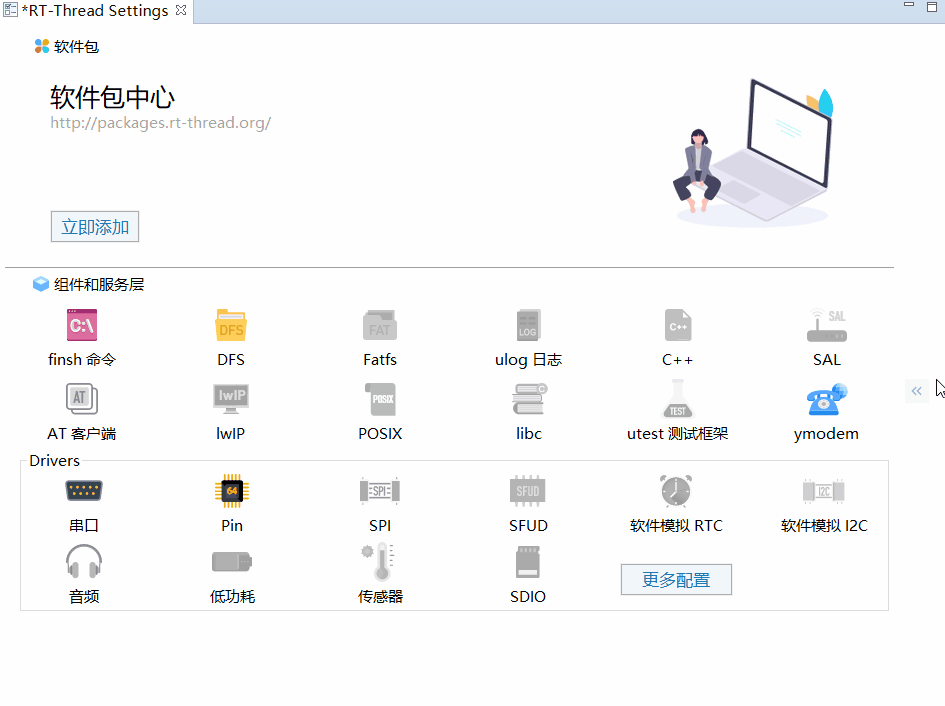

# **Mind Palace**  

## **TODO**  
1. RtThread 官方书+野火书 看完  **20%**
2. DFS文件系统，用 USB 模拟成 U盘，读写取 SPI Flash 内的内容  **5%**
3. 看下之前收藏的 Rt-Thread GUI 的历程学习一下，也是指南者开发板的 **0%**  
4. 4G 模块用官方串口工具连接腾讯云 **00%** 

## **这是 Neo 的个人笔记**  

### **个人发展**  
1. 笔记，记录是敦促个人发展、促进行业交流的最有效手段之一  
2. 图形化思维工具与展示  
   系统依赖关系图：  
   不同元素之间的依赖关系通过关系式的方式进行耦合。  
   修改一个变量后相关依赖会全部发生改变，并展示出所有改变量，在同一个画面内会同时看到之前的与改变后的方便进行对比。  
   整体结构类似于一个树状结构，或者是遗传结构  
   对根结构内的数据进行修改还会触发一些极限提醒，与其强依赖的模块会有提示警告，需要绝对重视进行测试与验证  

   这种关系图用代码的形式其实可以更好的进行编写与跳转管理，Excle 也是可以实现的不过还是不方便做复杂的交互设计  
   
   动图画，视频画，网页画（用网页的方式讲述故事，类似于一个带互动的沉浸式网页游戏，还可以做广告）  
3. C 语言深入
   - 可移植性
   - 模式设计
   - 看书：
   - 《程序员修炼之道》
4. RTOS
   - Rt-Thread 编程
   - 看完 官方书 + 野火书
   - 开始搭建工程
5. 效率化，自动化工具的开发
   - VSCode 插件开发 （xml格式下的代码框架自动生成工具）
   - 自动化监测工具 （小程序版）
   - 能力拆解：
     - Node 开发
     - 小程序开发
     - Vue 前端开发
     - Rt-Thread 开发
6. 硬件相关开发
   - 通讯接口的熟悉  
     - 485
     - CAN
7. 抓住指数级变量
   - 个人成长中有哪些是指数级别的变量呢？
   - 定期浏览 Boss 直聘
8. 学术相关
   - PID 高阶，看书，看国外大学课程。分数阶微积分  

### **关于自媒体**  
研发效率，观看可重复性  
急速传播性  
根据以上几点我觉得直接用 HTML 将自己的想法做成一个可交互的网站就十分的具有创造性，用于个人视频的录制，用于后面广泛的传播并且是高度交互的。  
视频下方附上连接，可以直接跳转到交互式网站的页面。  

**网页的好处？**  
相较于用 AE Pr 这些专用工具  
- 代码的可复用性比他们高2倍，后期做成模块后可以直接调用接口进行动画复用、转场复用  
- 灵活性高5倍  
- 对设备的硬件要求低3倍  
- 创作门槛其实是高3倍的，因为需要懂代码  
- 还有一个极高好处 ！！码的 ！！就是 ！！屏幕自适应，做成网站动效的形式，横屏竖屏是可以无缝切换的 ！！！！！码的，这个可以颠覆现有所有视频网站。因为大部分视频方式的都没有办法很好的做到这个，要做也可以做，但是需要拍摄两套的素材。哇塞这个 iDea 价值千万 ！！  
- 这个玩意可以直接画分镜脚本啊 ！！！码的这个 iDea 价值上亿 ！！！

实现第一步，熟悉使用 animejs 到精通  
https://animejs.com/  
https://codepen.io/  
看一下是否需要制作一个工具来方便个人的创作  

### **奇思异点**  
- VSCode 提供了一个全新的远程连接 VSCode 的开发方式，体验与不本地并没有太大差别，针对这种情况 多人开发的 Git 管理是否面临新的挑战，还是说可以在现有的 Git 功能上直接开发；粗略的想法：每个人登录后都会根据最新 commit 提交新建一个分支，commit的时候会自动提交，可以选择是否 Merge。这是一个粗略的解决方案  

### **Gif Test**  
 